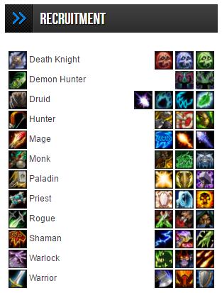

# World of Warcraft Recruitment Widget

This plugin adds a widget to Wordpress allowing you to display recruitment information for each of the class / specialisation combinations.
Priority is indicated by the opacity of the icon.

## Implemented Class / Specialisations

Class | Specialisation
----- | --------------
Death Knight | Blood, Frost, Unholy
Demon Hunter | Havoc, Vengeance
Druid | Balance, Guardian, Feral, Restoration
Hunter | Beast Mastery, Marksmanship, Survival
Mage | Arcane, Fire, Frost
Monk | Brewmaster, Mistweaver, Windwalker
Paladin | Holy, Protection, Retribution
Priest | Discipline, Holy, Shadow
Rogue | Assassination, Combat, Subtlety
Shaman | Elemental, Enhancement, Restoration
Warlock | Affliction, Demonology, Destruction
Warrior | Arms, Fury, Protection

## Recruitment Priority

Allows selection of a recruitment priority from:

* High
* Medium
* Low
* Closed

